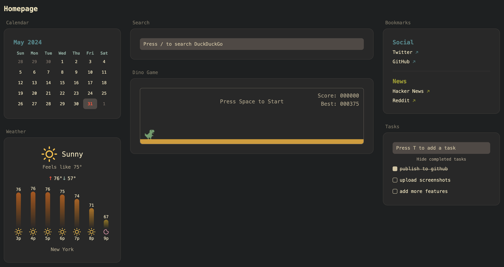

# React-Glance

This project is a ts/react app heavily inspired by [Glance](https://github.com/glanceapp/glance).

There are plenty of missing features and probably some bugs, but this project is more of a learning experience for me than anything else, as I'm trying to get more familiar with TypeScript, Next.js, React, and TailwindCSS. Feel free to contribute or use this project as a base for your own project!

## Widgets

- [x] Bookmarks
- [x] Calendar
- [x] Weather
- [x] Search bar (currently DuckDuckGo)
- [x] Task list
- [x] Dino game :) 

## Screenshots



## Getting Started

1. Clone this repository

```bash
git clone https://github.com/ianbulovic/react-glance.git
```

2. Install dependencies

```bash
npm i
```

3. Run the development server

```bash
npm run dev
```